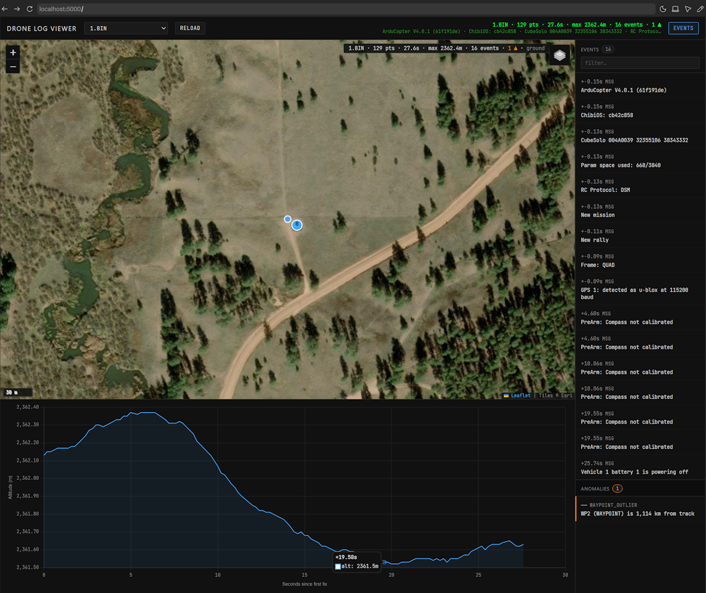

# DroneFlightViewer

Self-hosted ArduPilot/MAVLink flight-log viewer — map, telemetry, and forensic anomaly detection in a single tab. Built for the **Dark Wolf "Hack Our Drone" workshop training at DEF CON Singapore 1 (DCSG1)**.



## What it does

- Parses `.bin` / `.tlog` / `.log` via `pymavlink` into a structured JSON document
- Renders altitude-colored flight path on Leaflet (`leaflet-hotline`) with synced telemetry charts
- Chart hover scrubs the map cursor; map click jumps the chart — bidirectional sync
- Anomaly detection: GPS time gaps, position/altitude jumps, outlier waypoints
- Consolidates `MSG` / `STATUSTEXT` / `ERR` / `EV` into a single severity-coded event stream
- mtime-based JSON cache: re-parse only when the source log is newer than its cached output

## Quickstart

```bash
sudo apt install -y python3-flask python3-pymavlink   # Kali / Debian
# or, anywhere with pip:
pip install -r requirements.txt

python server.py                          # python3 on Linux
# then open http://127.0.0.1:5000
```

A sample DataFlash log [`logs/1.BIN`](logs/1.BIN) ships with the repo together with its parsed JSON cache, so the viewer loads with real data on first launch. Drop more `.bin` / `.tlog` / `.log` files into `./logs/` and refresh. Server binds `127.0.0.1:5000` only.

> **Demo-only?** `pip install flask` is enough — the bundled JSON cache is served without re-parsing, so `pymavlink` isn't needed unless you add new logs.

## CLI parser

For offline / scripted use without the web UI:

```bash
python3 parse.py mylog.bin                  # writes mylog.bin.json
python3 parse.py mylog.bin -o out.json --pretty
python3 parse.py mylog.bin -o -             # stdout, pipe into jq
```

## Forensic features

- **Anomaly detection**: GPS time gaps >1s, position jumps >50m, altitude jumps >10m, and waypoints farther than 50km from the track centroid (catches planted or leftover coordinates from previous missions)
- **Boot banner extraction**: firmware version string, board fingerprint, frame type — surfaced before any telemetry
- **Unified event stream**: all `MSG` / `STATUSTEXT` / `ERR` / `EV` records consolidated into one chronologically-sorted array, severity-coded (info / warn / error)
- **Wall-clock reconstruction**: derived from `GPS_RAW_INT` week + ms-of-week, so timestamps resolve even when `pymavlink._timestamp` doesn't
- **Home fallback chain**: `HOME` → `ORGN` → first valid GPS sample, with `home.source` attribution so you can see which one fired
- **mtime cache invalidation**: each parse drops a sibling `.json`; only re-parsed when the source log's mtime is newer

## Tile sources

No API keys required:

- Esri World Imagery (default satellite basemap)
- OpenStreetMap (street)
- OpenTopoMap (topographic)
- Esri Reference (label overlay, composable on top of imagery)

## JSON schema

Top-level shape of `parse.py` output:

```
filename       str
format         str        # "dataflash" | "mavlink" | "text" | "unknown"
firmware       str | null # joined boot-banner MSG lines
started_at     str | null # ISO 8601 UTC at the first GPS-locked sample
duration_s     float      # last - first track-point time, 0.0 if no track
home           { lat, lon, alt, source } | null
                          #   source: "HOME" | "ORGN" | "first_gps"
stats          {
                  gps_points, max_alt, max_speed, total_distance_m,
                  duration_s, events, anomalies, armed, bad_data_frames
                }
track          [{ t, lat, lon, alt, spd }]        # spd may be null
modes          [{ t, num, name }]                 # name null for unknown nums
events         [{ t, type, severity, message }]   # severity only on STATUSTEXT
                                                  # type: STATUSTEXT | MSG | ERR | EV
waypoints      [{ seq, cmd, cmd_name, lat, lon, alt, outlier }]
                                                  # outlier: > 50 km from track centroid
battery        [{ t, voltage, current }]          # volts, amps
anomalies      [{ t, kind, detail, lat, lon }]
                                                  # kind: gps_gap | gps_jump | alt_jump
                                                  #     | battery_anomaly | waypoint_outlier
                                                  # t and lat/lon may be null
```

All `t` values are seconds since the first GPS-locked sample — the same x-axis the chart uses.

## Stack

Python 3 / Flask / pymavlink + vanilla JS / Leaflet (with leaflet-hotline) / Chart.js (CDN, no build step).

## Workshop — Dark Wolf · Hack Our Drone · DEF CON Singapore 1 (DCSG1)

This repo is the visual companion to the **Dark Wolf "Hack Our Drone" workshop training delivered at DEF CON Singapore (DCSG1)**. The bundled flight log [`logs/1.BIN`](logs/1.BIN) is the reference DataFlash trace from the lab — open the viewer and walk it end to end. The forensic checks the workshop calls out (GPS time gaps, planted/outlier waypoints, altitude jumps, mode-change red herrings, suspect battery telemetry) light up on the map and chart automatically.

If you attended the session and want to retrace the exercises on your own captures, drop your `.bin` / `.tlog` / `.log` files into `./logs/` and refresh.

The pre-installed `mav*.py` tools (`mavlogdump`, `mavsummarize`, `mavgraph`) are fine in a terminal, but you can't *see* a 50 km outlier waypoint or a 30-second GPS gap in tabular output. This is the visual layer on top of `pymavlink`, with the forensic checks the lab actually cares about wired in by default.

> **Find this useful?** Star the repo so other DCSG1 / DEF CON SG attendees can find it. Search hooks: *Dark Wolf · Hack Our Drone · DEF CON Singapore · DCSG1 · ArduPilot forensics · MAVLink log analysis · drone log viewer · UAS forensics · pymavlink GUI*.
